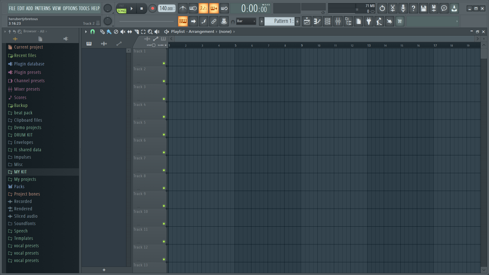
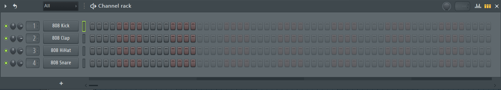
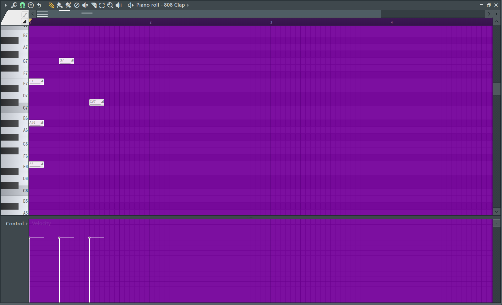
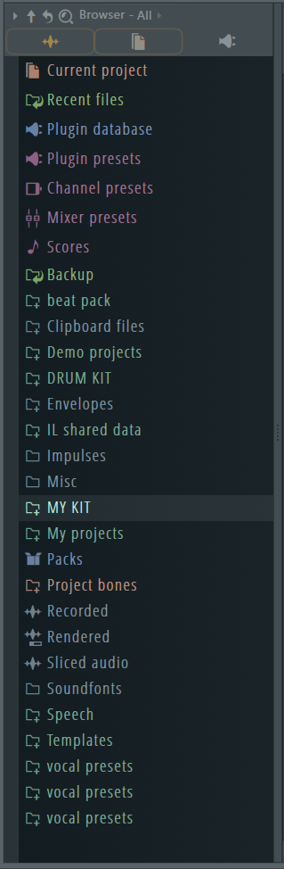
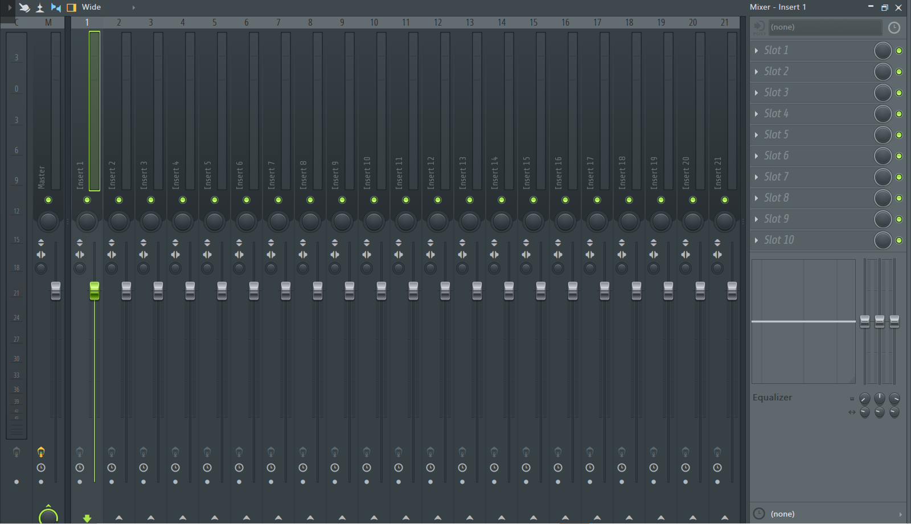
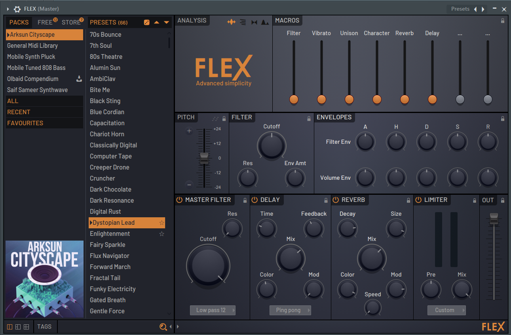
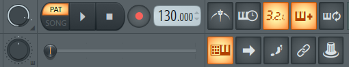

# Présentation d'une de ma composition FL Studio

photo prise de [wikipédia](https://fr.wikipedia.org/wiki/FL_Studio)

## Les bases de FL Studio
### ce logiciel comprend:  

- Un éditeur audio 

- Un séquenceur basé sur le concept de patterns

- Un Piano Roll

- Une banque de sons

- Un mixer

- Des VST's

- Une barre d'outils et de selection de BPM (Battement par minute)

## Ma piece fl studio

- Extrait

https://user-images.githubusercontent.com/93773589/145544835-2f282765-f0d1-479f-ab04-a2b7ccf2d551.mp4

## Décomposition de la piece

- mettre le bpm a 153 (relativement rapide comme bpm)

https://user-images.githubusercontent.com/93773589/145545389-428f3851-1100-43e8-8143-8cabb6c2be4a.mp4

- Ajouter un patern de drums de type hi-hats dans le séquenceur (1/2)

https://user-images.githubusercontent.com/93773589/145547702-9e28fe98-2af9-4867-b855-d249c63bd112.mp4

- Ajouter un patern de drums de type snare dans le séquenceur

https://user-images.githubusercontent.com/93773589/145547730-56f7e06d-0126-4b89-b911-10ba35510712.mp4

- Ajouter un patern de drums de type kick dans le séquenceur

https://user-images.githubusercontent.com/93773589/145547759-42b73b24-7b15-4534-b284-4aba7a8a173f.mp4

- Ajouter un patern de drums de type open-hat  dans le séquenceur

https://user-images.githubusercontent.com/93773589/145547871-d09e0d04-3d3f-43bf-8b32-e8f6527148ff.mp4

- Ajouter un patern de drums de typeà open-hat 2 dans le séquenceur

https://user-images.githubusercontent.com/93773589/145547911-5c0f3d00-58ff-4c7f-9ab9-5524e51f1034.mp4

- Ajouter un patern de drums de type bass dans le Piano virtuel

https://user-images.githubusercontent.com/93773589/145548250-313b5694-01be-4dfa-9cc7-64caf38c38fc.mp4

- Ajouter un patern de drums de type bass2 dans le Piano virtuel

https://user-images.githubusercontent.com/93773589/145548282-64a1943a-a29d-4195-b3d7-b8408e9113d5.mp4

- Ajouter un patern de drums de type pad 1 dans le Piano virtuel

https://user-images.githubusercontent.com/93773589/145548331-f400d705-9a27-4445-88b7-a729f824fc34.mp4

- Ajouter un patern de drums de type pad 2 dans le Piano virtuel

https://user-images.githubusercontent.com/93773589/145548343-3b42e9bd-e169-4dcc-b954-57d7889191ed.mp4

- Ajouter un patern de drums de type Lead 1 dans le Piano virtuel

https://user-images.githubusercontent.com/93773589/145548380-a155df28-7739-49f2-84ac-730e85a258d2.mp4

- Ajouter un patern de drums de type Lead 2 dans le Piano virtuel

https://user-images.githubusercontent.com/93773589/145548429-1b71aab1-2874-4282-b70f-3128e611ca45.mp4

## Rendu final

https://user-images.githubusercontent.com/93773589/145544835-2f282765-f0d1-479f-ab04-a2b7ccf2d551.mp4

